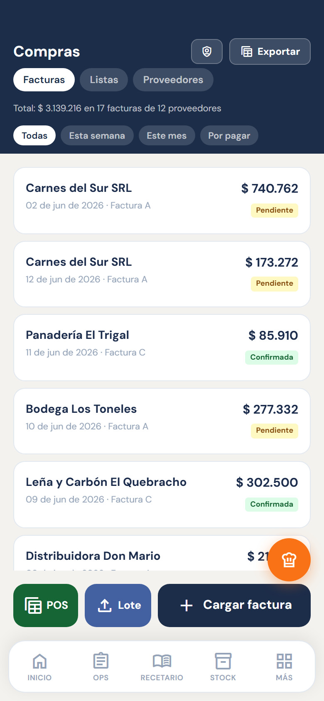
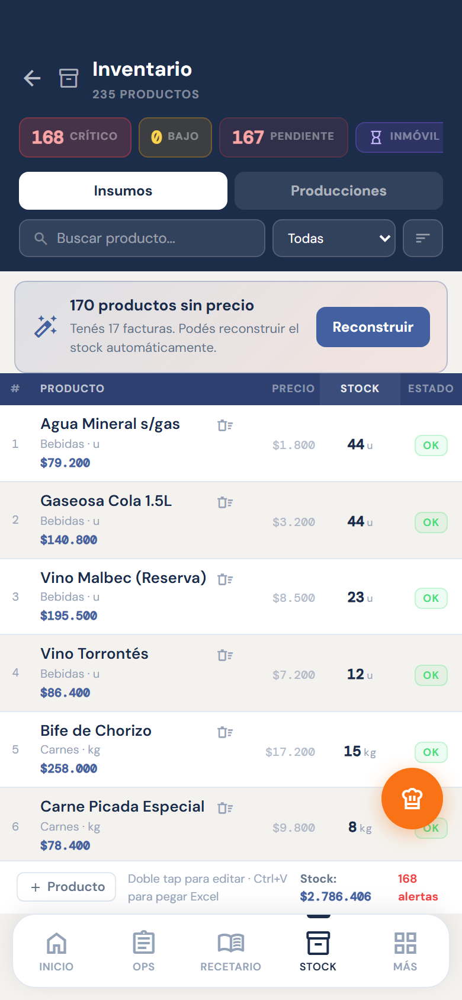
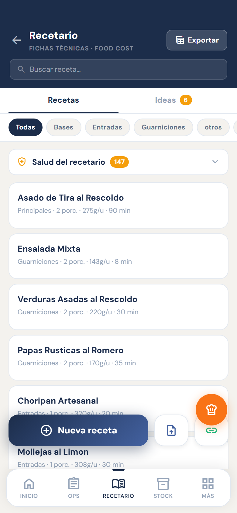
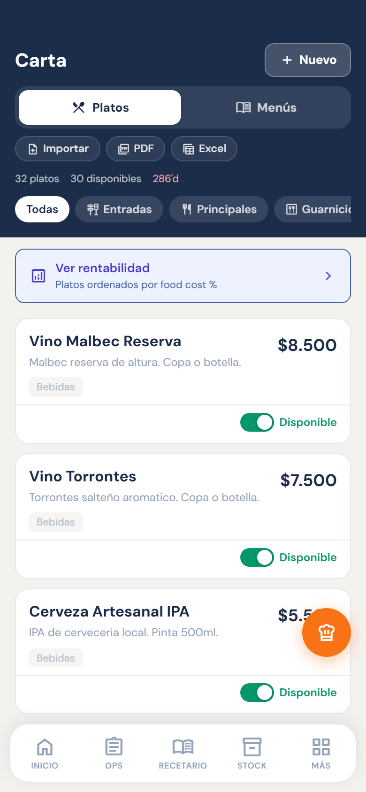
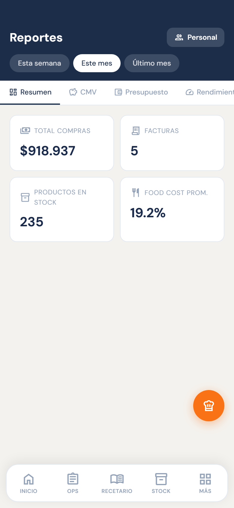
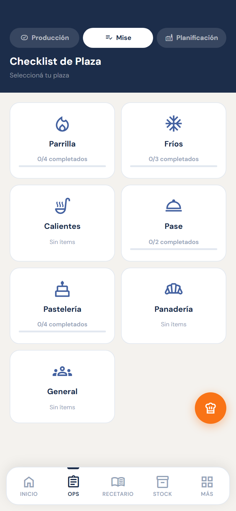
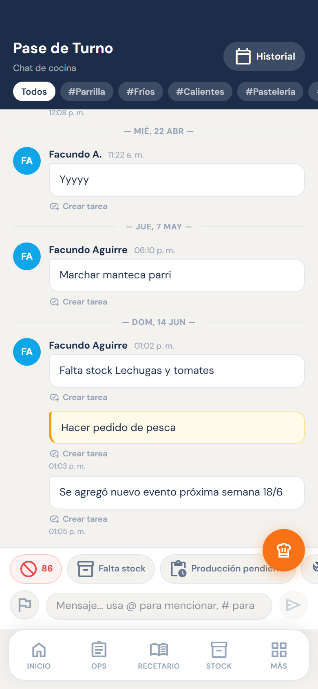
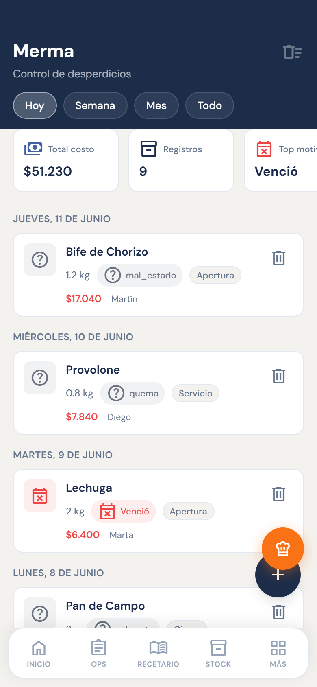
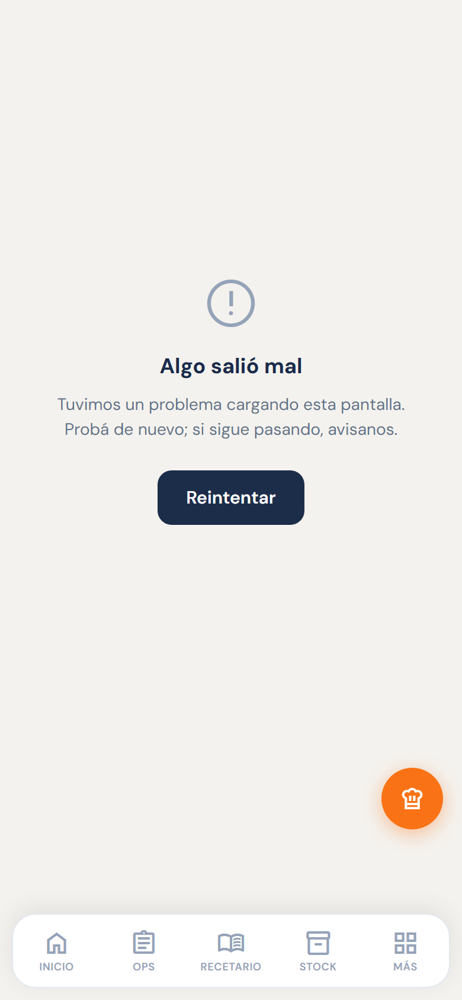

# Instructivo de carga de datos — KitchenOS

> Guía práctica para poner en marcha tu restaurante en KitchenOS y mantenerlo al día.
> Pensada para dos perfiles: **el administrador** (dueño, encargado o chef que gestiona la empresa) y **el equipo del día a día** (cocina, salón, compras).
> No hace falta saber de tecnología. Si seguís el orden, la app se arma casi sola.

---

## Cómo leer esta guía

- **Si sos el administrador**, leé todo de arriba hacia abajo. Vas a cargar los datos una vez al inicio (con el historial) y después mantenerlos semana a semana.
- **Si sos del equipo**, andá directo a la sección que te toca. Cada módulo aclara qué te resuelve en el servicio.

La idea de fondo es simple:

> **Primero le contás a KitchenOS qué comprás y a cuánto. A partir de ahí, la app sabe qué tenés, cuánto te cuesta cada plato, a cuánto conviene venderlo y cuánto ganaste de verdad.**

---

## Glosario rápido

| Término | Qué significa |
|---|---|
| **Food cost** | El porcentaje del precio de venta que se va en ingredientes. Si un plato sale $1.000 y los ingredientes cuestan $280, el food cost es 28%. |
| **CMV** | Costo de mercadería vendida: cuánto gastaste en insumos en un período, medido contra lo que vendiste. |
| **86** | Término de cocina: un plato "está en 86" cuando no se puede vender (se acabó, faltó insumo). Marcarlo en la carta avisa a todo el equipo al instante. |
| **Mise en place** | Las preparaciones previas al servicio: fondos, salsas base, cortes, marinadas. Lo que se deja listo antes de que lleguen los comensales. |
| **Plaza** | Estación de cocina: parrilla, fríos, calientes, repostería, etc. Cada plaza tiene su propio mise y sus propias tareas. |
| **Cuenta corriente** | Compra a crédito con el proveedor: la mercadería entra pero se paga después (30, 60 días). Aparece en el tab "Por pagar" de Facturas. |

---

## El orden importa

Los datos se cargan en este orden, porque cada uno se apoya en el anterior:

```
1. FACTURAS   →  qué compraste y a cuánto
2. STOCK      →  qué tenés hoy y cuándo se acaba   (se arma solo desde las facturas)
3. RECETARIO  →  cuánto cuesta producir cada cosa
4. CARTA      →  a cuánto lo vendés y cómo se ofrece
5. VENTAS     →  cuánto vendiste de verdad
```

No se puede saltear pasos sin perder precisión. Sin facturas no hay precios; sin precios no hay food cost; sin food cost no podés saber si un plato te deja ganancia.

> 💡 **Buena noticia:** no tenés que cargar todo a mano. Las facturas construyen el stock, las recetas leen los precios del stock y la carta lee el costo de las recetas. Tu trabajo es cargar bien la base y revisar.

Y hay una segunda etapa: una vez que la base está cargada, el equipo opera el día a día sobre esos datos (producción, mise, pase, merma, pedidos). Esa parte está al final de la guía, en **Etapa 2 — Operación diaria**.

---

## Paso 0 — Antes de cargar

### El asistente de primeros pasos

Si abrís la app con la cuenta vacía (sin facturas, productos ni recetas), se activa **automáticamente un wizard de 5 pasos** que te guía por la carga inicial: facturas → stock → recetario → carta → ventas. Es el camino más corto para arrancar desde cero.

### Crear el equipo

Antes de cargar datos, conviene invitar a las personas que van a operar la app:

1. Andá a **Turnos → Equipo**.
2. Tocá **Invitar por email**: ingresás el nombre, el email y el rol.
3. El invitado recibe un link, setea su contraseña y entra ya vinculado al restaurante.

### Qué ve cada uno

Los módulos visibles dependen del **puesto** asignado (configurable en Configuración). El administrador ve todo. Un cocinero puede ver solo OPS y Pase; un encargado de compras, solo Facturas, Stock y Pedidos. El puesto se puede cambiar en cualquier momento.

---

# ETAPA 1 — Carga de gestión

> **La hace el administrador** (dueño, encargado o chef). Una vez al inicio con el historial, y después se mantiene semana a semana. Es la base sobre la que después trabaja todo el equipo.

---

# 1 · FACTURAS

> **Quién la carga:** el administrador o el encargado de compras.



**Es el primer dato y el más importante.** Todo lo demás depende de las facturas: el stock, los precios, el historial de compras, el food cost real y los reportes. Sin facturas, KitchenOS funciona; **con facturas, se vuelve inteligente.**

## Cómo cargarlas

Hay tres formas y se pueden combinar libremente.

### Forma 1 — Subir el Excel de tu sistema de gestión *(la mejor para cargar el historial)*

Si usás Fudo, Maxirest, Bistrosoft u otro sistema con módulo de compras:

1. Exportá el cierre del mes como Excel desde tu sistema.
2. En KitchenOS, andá a **Facturas → Importar masivo** (o al tile **Importar** del inicio).
3. Subí el archivo y revisá antes de confirmar.

**Tips:**
- 💡 **En Fudo:** entrá a *Gastos → filtrá por mes → Exportar Excel*. El archivo trae dos hojas y el sistema necesita las dos.
- 💡 Si el Excel tiene varias hojas, la app elige sola la que tiene más información. Podés corregir la elección.
- 💡 **Cargá mes a mes, en orden cronológico.** La app guarda todo el historial, pero usa siempre el **precio más reciente** para calcular costos. Si cargás diciembre antes que junio, va a tomar los precios de diciembre como los vigentes.

### Forma 2 — Sacarle una foto o subir el PDF *(para la factura del día a día)*

1. En **Facturas**, tocá el botón **+**.
2. Sacá una foto a la factura o subí el PDF.
3. La app lee sola el proveedor, número, fecha, tipo, los productos con cantidad y precio, el total y la condición de pago.
4. **Siempre revisás en una pantalla antes de confirmar.**

**Tips:**
- 💡 Sale mejor con **luz pareja y la factura plana**. Si está arrugada o torcida puede fallar en algún renglón — por eso siempre hay pantalla de revisión.
- 💡 Los **remitos** de verdulería o mercado también sirven, aunque no tengan número formal.
- 💡 Para proveedores informales que no dan factura (pescadería del puerto, productor local), cargá una **factura manual** con lo que pagaste: igual actualiza el precio del producto.

### Forma 3 — Carga manual

Tocá **+** en Facturas y completá los campos a mano. Útil para compras muy chicas o sin papel.

## Filtro de privacidad *(importante si usás Fudo)*

Fudo anota sueldos, adelantos y pagos a socios como si fueran "gastos", mezclados con la mercadería. KitchenOS los detecta y los deja afuera solo.

- En **Facturas**, tocá el **botón con forma de escudo 🛡️**.
- Agregá los nombres de las personas o proveedores que **no** querés cargar (el socio, "Empleado", etc.).
- Queda guardado y se aplica a todas las importaciones de ahí en adelante.

## Qué pasa en la app cuando cargás una factura

| Se actualiza solo… | Qué pasa |
|---|---|
| **Stock** | Cada producto se crea o se actualiza: si ya existe, le refresca el precio; si no, lo crea con precio, unidad y categoría. |
| **Precios / Inflación** | Guarda el precio por unidad. En Reportes ves la evolución mes a mes de cada producto. |
| **Proveedores** | Si el proveedor no existía, se crea solo. |
| **Reportes (CMV, Compras, Presupuesto)** | Las compras entran al costo de mercadería y a los rankings de gasto. |
| **Pedidos** | Cuando le pedís a un proveedor, te sugiere lo que más le comprás. |
| **Food cost de recetas** | Si sube el precio de un insumo, el costo de toda receta que lo use se recalcula solo. |

## Qué te resuelve en la práctica

**Si sos el administrador**
- Saber cuánto gastaste en el mes, por proveedor y categoría, **sin armar una planilla**.
- Ver qué productos subieron y cuánto — clave para decidir cuándo ajustar la carta.
- Detectar facturas impagas o cuentas corrientes pendientes.
- Tener el CMV del mes sin que el chef reporte nada.

**Si sos el encargado de compras**
- No recargar cada producto al stock a mano: la factura lo hace.
- Comparar el precio de esta semana contra el del mes pasado.
- Detectar faltantes de una entrega cruzando la factura con el stock.

**Si sos emprendedor sin contador**
- Todos los gastos de mercadería con una foto.
- Historial ordenado para presentar en un crédito o balance.

## Funciones extra que conviene conocer

1. **Alerta de subas de precio.** Al confirmar una factura, si un producto subió más de lo esperado, la app avisa: *"Tomate perita subió 34% vs la última compra"*. Aceptás o corregís antes de guardar.
2. **Cuentas por pagar.** Un tab **Por pagar** en Facturas y un indicador en el inicio te muestran cuánto le debés a cada proveedor.
3. **Reconciliación factura ↔ pedido.** Podés vincular la factura que llega con el pedido que hiciste por KitchenOS para detectar diferencias de precio o cantidad.

---

# 2 · STOCK / INVENTARIO

> **Quién lo carga:** el administrador lo configura; el equipo lo cuenta en el día a día.



**Es el segundo dato, y en gran parte se arma solo a partir de las facturas.** Mientras Facturas responde *"qué compré y a cuánto"*, el Stock responde *"qué tengo hoy y cuándo se me acaba"*. Es la base del food cost, las alertas de reposición y los pedidos.

## Cómo cargarlo

Cuatro caminos, de menos a más trabajo manual.

### Camino 1 — Automático desde las facturas *(el preferido)*

Si ya cargaste facturas, **el stock ya existe**: cada producto facturado se creó con su precio, unidad y categoría.

Si quedó incompleto o desordenado, usá **Stock → Rebuild**: borra los productos y los reconstruye desde todas las facturas, con el precio más reciente de cada uno.

- ⚠️ **Rebuild reconstruye todo desde las facturas.** Los productos que cargaste a mano, los conteos del Stockear y las correcciones de unidad que no vengan de factura se pierden. Usalo al armar la base, no como mantenimiento de rutina.
- 💡 Si no hay facturas cargadas, Rebuild no borra nada.

### Camino 2 — Importar tu propio Excel de inventario

En **Stock → Importar**, subís tu Excel/CSV. La app reconoce las columnas (nombre, precio, unidad, categoría, stock actual, mínimo) aunque se llamen distinto, y te deja revisar.

- 💡 No hace falta un formato específico.
- 💡 Para productos "por unidad", cargá la medida unitaria para que el food cost calcule bien.

### Camino 3 — Modo rápido para hacer el inventario *(stock-take)*

En **Stock → Stockear**: elegís el sector y la app te va mostrando producto por producto, en pantalla grande, para que cargues la cantidad real contada. Pensado para recorrer la heladera o el depósito con el celular.

### Camino 4 — Manual, uno por uno

Tocá **+** y cargá nombre, categoría, unidad, stock actual, mínimo, crítico y precio. Para altas sueltas o cosas que no vienen de factura.

## Qué pasa en la app

| Módulo | Qué pasa |
|---|---|
| **Inicio** | Lo que está en crítico o bajo aparece en "Stock crítico" y en la campana de alertas. |
| **Recetario** | El precio del producto alimenta el costo de cada ingrediente → food cost real. |
| **Carta** | El food cost de cada plato sale de los productos de sus recetas. |
| **Pedidos** | Lo bajo/crítico es lo que te sugiere pedir. |
| **Merma** | Al registrar una merma, se descuenta del stock solo. |
| **Mise / Producción** | Las cantidades "por unidad" se calculan con la medida del producto. |
| **Reportes** | Valorización del inventario y comparación de precios. |

## Qué te resuelve en la práctica

**Si sos el administrador**
- Saber **cuánta plata tenés parada** en mercadería ahora.
- Que nadie cargue el inventario a mano: las facturas lo construyen.
- Food cost confiable porque los precios están al día.

**Si sos el encargado o chef**
- Ver de un vistazo qué está por agotarse **antes** de que falte en pleno servicio.
- Hacer el inventario físico con el celu en vez de planilla y lápiz.
- Detectar diferencias entre el sistema y la heladera (mermas, desperdicio).

**Si sos emprendedor**
- Arrancar sin cargar nada: subís facturas y ya tenés stock.
- Saber qué reponer sin depender de la memoria.

## Funciones extra que conviene conocer

1. **Producciones internas como ítem de stock.** Caldos, masas, fondos, salsas base — cosas que se producen y nunca aparecen en factura. Al crear el producto lo marcás como **"producción interna"** y le vinculás una receta: el costo se toma solo de esa receta. Lleva un badge "Producción" en la lista.
2. **Mínimo y crítico sugeridos.** En vez de cargar los umbrales a mano, la app los sugiere según **cuánto y cada cuánto comprás** cada producto. Botón **"Sugerir mínimos"**.
3. **Alerta de stock inmóvil (capital dormido).** Detecta productos **sin compras hace mucho** que todavía tienen stock: *"Tenés $X parados en productos que no rotan"*. Sirve para no sobre-comprar y detectar mercadería por vencer.

---

# 3 · RECETARIO

> **Quién lo carga:** el administrador o el chef.



**Es el dato que convierte el stock en rentabilidad.** Con los productos costeados (de las facturas), el recetario calcula **cuánto cuesta cada plato** y, contra el precio de venta, su **food cost**. Sin recetas, KitchenOS sabe qué comprás; con recetas, sabe **si ganás plata con cada plato**.

## Cómo cargarlo

Cuatro caminos, combinables.

### Camino 1 — Importar fichas técnicas con IA *(el más rápido)*

En **Recetario → Importar**, subí una foto, PDF o texto de la ficha técnica. La app extrae **nombre, ingredientes con cantidad y unidad, procedimiento y porciones**. Podés cargar varias fichas de una.

- 💡 Después de importar, la app intenta **vincular cada ingrediente a un producto del stock** para traer el costo real. Los que no encuentra quedan marcados para que los revises.

### Camino 2 — Carga manual

Tocá **+** y cargá nombre, porciones, precio de venta, ingredientes (el buscador trae los productos del stock) y procedimiento. El food cost se calcula en vivo.

### Camino 3 — Ideas (borradores) → completar con IA

En el tab **Ideas** anotás solo el nombre de un plato. Después, con **"Completar con IA"**, pegás los ingredientes y pasos y la app completa la receta (podés dictarlos con el micrófono del teclado de tu celular).

### Camino 4 — Desde la Carta

Cuando armás un plato y buscás un componente que todavía no existe como receta, lo creás como **borrador** ahí mismo y queda vinculado.

## Qué pasa en la app

| Módulo | Qué pasa |
|---|---|
| **Carta** | El food cost de cada plato sale de las recetas que lo componen. |
| **Stock** | Los ingredientes leen el precio del producto; una producción interna toma su costo de la receta. |
| **Mise / Producción** | Las recetas de un plato definen qué se produce y en qué cantidad por plaza. |
| **Pase / Tareas** | Una receta se puede mandar a producir como tarea. |
| **Reportes** | Food cost promedio, recetas más caras, evolución del costo por inflación. |

## Qué te resuelve en la práctica

**Si sos el administrador**
- Food cost **real** de cada plato, no estimado.
- Ver al instante qué recetas dejaron de ser rentables cuando suben los insumos.
- Estandarizar: que el plato salga igual lo haga quien lo haga.

**Si sos chef o cocinero**
- Todas las fichas técnicas en el celular, no en una carpeta que se moja.
- Escalar una receta a la cantidad a producir sin recalcular a mano.
- Cargar recetas sin pelearte con planillas: foto y listo.

**Si sos emprendedor**
- Poner precios con fundamento, no "a ojo".
- Detectar qué plato conviene empujar y cuál hace perder plata.

## Funciones extra que conviene conocer

1. **Escalado de receta.** En el detalle, con **"Producir N porciones"**, las cantidades de cada ingrediente se recalculan al instante. Para producir 80 porciones de salsa sin calculadora.
2. **Salud del recetario.** Un panel agrupa las recetas con **costeo incompleto**, **food cost crítico (>35%)** o **sin precio de venta**, con acceso directo para corregir cada una.
3. **Sugerir precio de venta.** Le decís un food cost objetivo (ej. 30%) y la app te sugiere a cuánto vender el plato. Clave para reajustar la carta rápido con la inflación.

---

# 4 · CARTA

> **Quién la carga:** el administrador define precios; el equipo marca disponibilidad (86) en el día.



**Es la capa que junta todo y mira al cliente.** Si el recetario calcula cuánto cuesta un plato, la Carta define **a cuánto lo vendés, cómo se agrupa y si está disponible**. Es el puente entre la cocina y el salón.

> Jerarquía: ingrediente → receta → **plato** → menú.

## Cómo cargarla

### Camino 1 — Importar con IA *(el más rápido)*

En **Carta → Importar**, subí una foto de la carta impresa, PDF, Excel o texto. La app extrae **nombre, componentes, porciones, precio y tags dietarios** (S/TACC, vegano, vegetariano, keto, picante, sin lactosa).

- 💡 En el preview, cada componente se vincula solo a una receta/producto; lo que no encuentra se crea como borrador.

### Camino 2 — Crear un plato a mano

Tocá **+ Nuevo** y cargá nombre, precio, categoría, tags y composición (buscador de recetas/productos). El **food cost se calcula en vivo**.

### Camino 3 — Menús y eventos

El mismo editor crea Menús fijos o Eventos: preparaciones por curso, con plaza, prioridad (SP/P/REF/Check) y cantidad. Además le cargás una **vigencia** (desde/hasta) — pensada para un menú ejecutivo que sale una o dos semanas.

Hay dos formas de ponerlo en marcha, según lo que necesites:
- **Activar en Planificación** (calendario) — genera una tarea de producción por día para cada preparación. Sirve para "avisale al equipo que hoy hay que producir esto".
- **Activar en el mise** (botón en Carta → Menús) — mete las preparaciones en el mise de su plaza, con su prioridad. A diferencia de Planificación, esto queda **fijo mientras dure la vigencia**: se revisa en cada apertura y cada cierre, igual que cualquier otro ítem del mise, y desaparece solo cuando el menú deja de estar vigente.

## Qué pasa en la app

| Módulo | Qué pasa |
|---|---|
| **Recetario** | Cada plato lee el food cost de sus recetas; un cambio de costo se refleja solo. |
| **Mise / Producción** | Asignar un componente a OPS crea o actualiza el ítem de mise por plaza. "Activar en el mise" hace lo mismo para todo un menú/evento, mientras esté vigente. |
| **Planificación** | Activar un menú genera las tareas de producción del día. |
| **Pase / Servicio** | El **86** le avisa al equipo qué plato no sale. |
| **Reportes / Ventas** | El precio de venta es la base del CMV, el margen y el ticket promedio. |

## Qué te resuelve en la práctica

**Si sos el administrador**
- Ver food cost y margen de cada plato **al lado de su precio** y decidir con datos.
- Subir la carta entera con una foto, sin tipear decenas de platos.
- Saber qué platos rinden y cuáles repensar.

**Si sos chef o encargado**
- Marcar **86** al instante y que todo el equipo lo vea.
- Carta siempre sincronizada con lo que la cocina puede producir.

**Para el salón / comensal**
- Carta clara, con tags dietarios y sin platos que "no hay".

## Funciones extra que conviene conocer

> Las tres viven en **Carta → Rentabilidad**.

1. **Ingeniería de menú.** Cruza **ventas** (popularidad) × **margen** (rentabilidad) y clasifica cada plato en **Estrella / Caballo / Puzzle / Perro**, con una recomendación por cada uno (mantener, reprecio, promocionar, sacar). *Sin ventas cargadas, clasifica solo por rentabilidad.*
2. **Reprecio por inflación (en lote).** Definís un food cost objetivo y la app lista los platos que se pasaron y sugiere el nuevo precio. Aplicás de a uno o todos juntos.
3. **Salud de la carta.** Agrupa los platos a revisar: **sin receta vinculada**, **margen negativo**, **en 86** y **sin categoría**.

---

# 5 · VENTAS

> **Quién las carga:** el administrador o el encargado, al cierre.

**Es el dato que cierra el círculo.** Facturas, Stock, Recetario y Carta responden *"cuánto cuesta y a cuánto vendo"*; **Ventas responde "cuánto vendí de verdad"**. Transforma los food cost teóricos en rentabilidad real: con ventas cargadas, KitchenOS sabe tu CMV, tu ticket promedio y qué platos se mueven.

## Cómo cargarlas

### Camino 1 — Importar desde tu POS *(lo más común)*

En **Ventas → Importar**, subí el Excel/CSV del cierre. Lee el total y, si está el detalle, los platos vendidos con cantidad y precio. Revisás antes de guardar.

- 💡 Usá el reporte de **"productos vendidos"** (no solo el total): así se carga el mix y se desbloquea la ingeniería de menú.
- 💡 Cargá por período cerrado (día/semana/mes).

### Camino 2 — Pegar texto

Pegás el texto del cierre o de un WhatsApp y la app lo estructura sola: total, cubiertos y platos. Si usás el celular, podés dictar el texto con el micrófono del teclado antes de pegar.

### Camino 3 — Cierre rápido del día

Botón **"Cargar cierre del día"** en Resumen: fecha + total + cubiertos en un toque. Para el cierre simple de cada noche.

## Qué pasa en la app

| Módulo | Qué pasa |
|---|---|
| **Reportes → CMV** | Ventas × compras del período → costo de mercadería y food cost real. |
| **Reportes → Presupuesto vs Real** | Ventas reales contra el objetivo. |
| **Carta → Ingeniería de menú** | Los platos vendidos dan la popularidad que clasifica cada plato. |
| **Reportes → Rendimiento** | Ticket promedio, cubiertos y evolución. |

## Qué te resuelve en la práctica

**Si sos el administrador**
- Food cost **real** del mes (no el teórico): cuánto de cada $100 vendido se fue en mercadería.
- Ticket promedio y su evolución.
- Qué platos sostienen la facturación y cuáles casi no se venden.

**Si sos chef o encargado**
- Saber qué se vende para producir acorde.
- Justificar decisiones de carta con números.

**Si sos emprendedor**
- Foto clara de ingresos vs costos, sin planillas.
- Medir si una promo o un cambio de precio funcionó.

## Funciones extra que conviene conocer

1. **Ranking de platos vendidos.** El tab **Platos** muestra los más y menos vendidos del período con su **% de participación** sobre la facturación (top en verde, cola en rojo).
2. **Food cost teórico del período.** Cruza los platos vendidos × el costo de su receta y te dice cuánto **deberías** haber gastado. Comparado con tus compras reales, revela la fuga (merma, porciones de más, robo).
3. **Cierre diario rápido + alerta de días sin cargar.** Cargás el total del día en un toque y la app te avisa cuántos días del mes quedaron sin ventas — porque con huecos el CMV y el ticket promedio mienten.

---

# 6 · REPORTES — LO QUE TE DEVUELVE LA CARGA

> **Quién lo usa:** el administrador, al cierre de cada período.



**Acá está el pago de todo el esfuerzo de carga.** Con facturas, ventas y recetario cargados, Reportes te muestra si el negocio da plata — sin armar una sola planilla.

## Qué encontrás

**CMV del mes (Costo de Mercadería Vendida)**
Cruza tus compras (de las facturas) contra tus ventas del período y calcula cuánto de cada peso vendido se fue en mercadería. El número que todo dueño necesita saber. Se alimenta de: facturas + ventas.

**Inflación de cocina**
Evolución del precio de cada producto mes a mes. Ves al instante qué insumos subieron más y cuándo conviene ajustar la carta o buscar alternativa de proveedor. Se alimenta de: facturas.

**Presupuesto vs Real**
Definís un objetivo de gasto o de ventas por período (semanal/mensual/trimestral) y la app lo contrasta contra los números reales. Se configura directamente en la pantalla de Reportes. Se alimenta de: facturas + ventas.

**Valorización del stock**
Cuánta plata tenés parada en la heladera y el depósito ahora mismo, calculada con los precios de la última factura de cada producto. Se alimenta de: stock + facturas.

## Qué te resuelve en la práctica

**Para el dueño / administrador**
- Saber si el mes fue rentable, en números, sin depender de la memoria o del contador.
- Ver cuándo conviene subir precios: si el costo del bife subió 20%, el food cost de los platos con bife ya lo refleja.
- Detectar si una promo o un evento mejoró el ticket promedio.
- Controlar el presupuesto de compras sin planillas.

> 💡 **Si los números parecen raros**, casi siempre falta alguno de estos tres datos: facturas del mes completo, ventas del período o recetas con ingredientes vinculados al stock. Revisá el panel "Salud del recetario" y el tab "Por cargar" en Ventas.

---

# ETAPA 2 — Operación diaria

> **La hace el equipo** (cocina, salón, compras) durante el servicio. Se apoya sobre los datos que cargó el administrador en la Etapa 1: produce lo que define la carta, descuenta del stock, pide a los proveedores que ya están cargados.

A diferencia de la Etapa 1 (que se hace una vez y se mantiene), esta etapa es **del día a día**: se usa en cada turno, en el celular, durante el servicio.

---

## 7 · OPS / PRODUCCIÓN Y MISE

> **Quién lo usa:** todo el equipo de cocina. El administrador o chef planifica; los cocineros ejecutan.



**Es el centro de la operación diaria.** Acá se decide y se sigue **qué hay que producir hoy**, **qué mise en place** dejar listo y **cómo se reparte el trabajo por plaza**. Vive en una sola pantalla (**Operaciones**) con tres pestañas.

### Las tres pestañas

**1 · Producción** — La lista de tareas del día: qué se cocina o se prepara, con su **prioridad** (crítica/alta/media/baja), la **plaza** que la hace y quién la tiene asignada. Cada tarea se **tilda en verde** cuando está lista, y el equipo ve el avance del turno en tiempo real.

- 💡 Lo que queda sin terminar **se arrastra al día siguiente** (un día), para que nada se pierda.

**2 · Mise** — El checklist de **mise en place** por plaza: las preparaciones previas que hay que dejar listas antes del servicio. Calcula **cuánto producir** según el recipiente y el tamaño de porción, y muestra el **déficit** ("te faltan 20 porciones, producí 1,5 kg"). Tiene una sub-pestaña **Rutina** con las tareas que se repiten (limpieza, controles) el día que corresponde.

- 💡 Un ítem puede venir de un **Menú/Evento activado** desde Carta (ver sección 4) — se distingue con un chip violeta con el nombre del menú, y desaparece solo cuando el menú deja de estar vigente.

**3 · Planificación** — Donde se arma la producción a futuro. Se **activa un menú o evento** (los que cargaste en la Carta) y eso **genera solas las tareas de producción** del día, repartidas por plaza. También se planifica por fecha.

### Cómo se carga / se usa

- **Crear una tarea suelta:** botón **+** → título, plaza, prioridad, a quién se la asignás.
- **Generar producción desde un menú:** pestaña Planificación → elegís el menú → **Activar** → aparecen las tareas en Producción.
- **Mandar a producir una receta:** desde el Recetario o la Carta, una receta se puede enviar como tarea de producción.

### Qué te resuelve

**Para el chef / encargado**
- Repartir el trabajo por plaza sin papelitos ni gritos.
- Ver el avance del turno de un vistazo: qué está listo y qué falta.
- Que el mise se calcule solo (cuánto producir), sin cuentas a mano.

**Para el cocinero**
- Saber exactamente qué le toca hacer hoy, en su plaza, sin preguntar.
- Tildar lo que va terminando y que el equipo lo vea.

**Para el dueño**
- Que la producción salga de la carta automáticamente, estandarizada.

---

## 8 · PASE / SERVICIO

> **Quién lo usa:** toda la cocina y el pase, durante el servicio.



**Es la "radio" de la cocina en tiempo real.** Reemplaza los gritos y los papelitos del servicio: un canal donde el equipo se comunica al instante qué pasa en cada plaza.

### Cómo se usa

- Escribís un mensaje y lo ves todo el equipo al toque.
- Podés **mencionar a alguien** con `@nombre` o a una plaza con `#parrilla`, `#fríos`, `#calientes`, etc.
- Hay **mensajes rápidos** de un toque: *Falta stock*, *Producción pendiente*, *Equipo roto*, *Reserva especial*, *Limpieza pendiente*, *Todo OK*.
- Cada mensaje puede llevar **prioridad** para que lo urgente resalte.

### Qué te resuelve

**Para el equipo de cocina**
- Comunicar un 86, un faltante o un problema sin frenar el servicio.
- Que quede registro de lo que pasó en el turno (no se pierde en el ruido).

**Para el chef / encargado**
- Coordinar plazas sin estar físicamente en cada una.
- Avisar reservas especiales o cambios a todos de una.

---

## 9 · MERMA

> **Quién lo usa:** cocina y encargados, en el momento en que algo se desperdicia.



**Es donde se registra lo que se desperdicia o se descarta**, para que el stock y el food cost no mientan. Cada merma que cargás **se descuenta sola del stock** y suma a la estadística de pérdidas.

### Cómo se carga

Botón **+** → elegís el producto, la cantidad, el **motivo** (vencimiento, mal estado, error de preparación, devolución, etc.) y el turno. La app calcula el **costo estimado** de lo perdido con el precio del producto.

- 💡 Tenés vistas por **Hoy / Semana / Mes / Todo** para ver cuánta plata se fue en desperdicio.

### Qué te resuelve

**Para el dueño / administrador**
- Saber **cuánto se pierde de verdad** y por qué — la merma es plata que se va sin venderse.
- Cruzar la merma con el food cost teórico para encontrar la fuga.

**Para el chef / cocinero**
- Que el stock refleje la realidad (lo que se tiró no está más en la heladera).
- Detectar si un producto se desperdicia siempre por la misma razón (compra de más, mala rotación).

---

## 10 · PEDIDOS

> **Quién lo usa:** el encargado de compras o el chef.



**Es donde armás los pedidos a proveedores**, apoyándote en lo que la app ya sabe: qué está bajo en stock, qué le comprás siempre a cada proveedor y a qué precio.

### Cómo se arma

1. Elegís el **proveedor** (de los que ya se crearon solos con las facturas).
2. La app te **sugiere los productos** que más le comprás y los que están **bajos o críticos** en stock, con un precio estimado.
3. Ajustás cantidades y confirmás.
4. Lo **enviás por WhatsApp** o lo **exportás en PDF** directo al proveedor.

Cada pedido tiene un estado: **Borrador → Enviado → Parcial → Recibido**.

- 💡 Cuando llega la mercadería y cargás la factura, podés **vincularla al pedido** para detectar diferencias entre lo que pediste y lo que te facturaron.
- 💡 **Para mandar el pedido por WhatsApp**, cargale el teléfono al proveedor en el módulo **Proveedores**. Los proveedores que se crean solos desde las facturas nacen sin teléfono.

### Qué te resuelve

**Para el encargado de compras**
- Armar el pedido en minutos, sin revisar la heladera producto por producto.
- Mandarlo por WhatsApp sin tipear la lista a mano.
- No olvidarte de reponer lo que está por agotarse.

**Para el dueño**
- Pedidos con precio estimado: sabés cuánto vas a gastar antes de comprar.
- Control de lo pedido vs lo recibido.

---

## 11 · SALÓN / KDS *(en prueba)*

> **Quién lo usa:** el mozo/cajero (salón) y el cocinero (KDS).

La app incluye una **vista de servicio** pensada para el turno en vivo: funciona en tablet o celular, con alto contraste y botones grandes.

**Qué tiene:**
- **Mapa de mesas:** abrís la mesa, cargás los ítems de la carta y mandás la comanda a cocina.
- **Pantalla KDS (Kitchen Display System):** la cocina ve las comandas en tiempo real por estación, las tilda o las "bumpea" al pasarlas.
- **Cobro multi-medio:** efectivo, tarjeta, transferencia o combinado. Genera el resumen del ticket.
- **86 bidireccional:** lo que el encargado marca como 86 en la carta no se puede pedir en el salón, y lo que se agota en el KDS actualiza la carta automáticamente.

> Esta funcionalidad está en prueba activa. El flujo completo se documenta aparte.

---

# Problemas frecuentes

## "El food cost me da bajísimo / un ingrediente no suma al costo"

Casi siempre es un producto cargado **"por unidad"** con precio que en realidad es por kg o litro. La app detecta la inconsistencia y excluye esa línea del costo para no inflarlo, pero eso deja ese ingrediente fuera del cálculo.

**Cómo corregirlo:** andá a **Stock → filtro "Unidades a revisar"**: aparecen todos los productos con unidad `u` y precio alto. Seleccioná la unidad real (kg, l, g, ml) y aplicá los cambios en lote. El food cost de las recetas que usan ese producto se recalcula solo.

## "Cargué los meses de facturas desordenados"

No hay problema: reimportá el mes que faltaba. Después, para que los precios vigentes queden bien, corré **Stock → Rebuild**: reconstruye el stock usando el precio más reciente de cada producto en todo el historial de facturas.

## "Importé un archivo equivocado"

Las importaciones de **stock** y **proveedores** se pueden deshacer. Aparece un banner justo después del import con el botón **Deshacer**: lo tocás y se revierten los cambios de ese archivo.

## "Quedaron ingredientes sin vincular al stock"

Después de importar recetas, la app corre un **vínculo automático** que empareja cada ingrediente con el producto del stock más parecido. Los que no matchean quedan sin costo. Para revisarlos: **Recetario → Salud del recetario** (agrupa todas las recetas con costeo incompleto). Entrás a cada receta y buscás el producto correcto en el campo del ingrediente.

---

# Resumen — la rutina recomendada

**Al arrancar (una sola vez):**
1. Cargá el historial de **facturas** mes a mes, en orden.
2. Hacé un **Rebuild** del stock para que se arme desde las facturas.
3. Cargá o importá tu **recetario** y revisá los ingredientes sin vincular.
4. Subí tu **carta** y poné los precios.
5. Cargá el historial de **ventas** con detalle de platos.

**Cada semana:**
- Subí las **facturas** nuevas (foto o Excel).
- Revisá las **alertas de precio** y de stock.
- Cargá las **ventas** del período.

**Cada día (equipo — Etapa 2):**
- Revisá la **Producción** del día en OPS y tildá lo que va saliendo.
- Dejá listo el **mise** de tu plaza.
- Usá el **Pase** para comunicar 86, faltantes o problemas.
- Marcá **86** en la carta lo que no sale.
- Registrá **merma** cuando se descarta algo.
- Armá los **pedidos** a proveedor de lo que está bajo.
- Hacé el **cierre del día** en Ventas.

> Si seguís esta rutina, KitchenOS te devuelve food cost real, CMV, alertas de reposición y rentabilidad por plato **sin que tengas que armar una sola planilla.**

---

# Tabla resumen — qué, dónde y con qué frecuencia

> Para imprimir y pegar en la cocina o la oficina.

| Dato | Dónde se carga | Quién | Frecuencia |
|---|---|---|---|
| **Facturas** | Facturas → **+** (foto/PDF) o → Importar masivo (Excel) | Administrador / encargado de compras | Por cada compra; cierre de mes |
| **Conteo de stock** | Stock → **Stockear** | Encargado / equipo | Semanal o por turno |
| **Recetas** | Recetario → Importar (IA) o **+** | Chef / administrador | Al inicio; cuando cambia la oferta |
| **Precios de carta** | Carta → editar plato → precio | Administrador | Cuando cambia el costo o la estrategia |
| **Ventas** | Ventas → Importar (Excel POS) o Cierre del día | Administrador / encargado | Diario o semanal |
| **Merma** | Merma → **+** | Cocinero / encargado | Cada vez que se descarta algo |
| **Pedidos a proveedores** | Pedidos → Nuevo pedido | Encargado de compras | Según necesidad / stock bajo |
| **86** | Carta → marcar 86 en el plato | Cualquier persona del equipo | Cuando sale o vuelve un plato |
